# Crawling 연습

- 크롤링은 웹 크롤러(web crawling)에서 출발한 말로 크롤러는 무수히 많은 인터넷 상의 페이지(문서, html 등)를 수집해서 분류하고 저장한 후에 나중에 쉽게 찾아볼 수 있도록 하는 역할을 하는 일종의 로봇입니다. 크롤링은 웹 상의 문서를 수집해주는 작업을 크롤링이라고 합니다.

- 바탕화면에 ‘crawling’ 폴더를 생성하고 파이참으로 실행하였다.
    - visual code로 실행해도 된다.

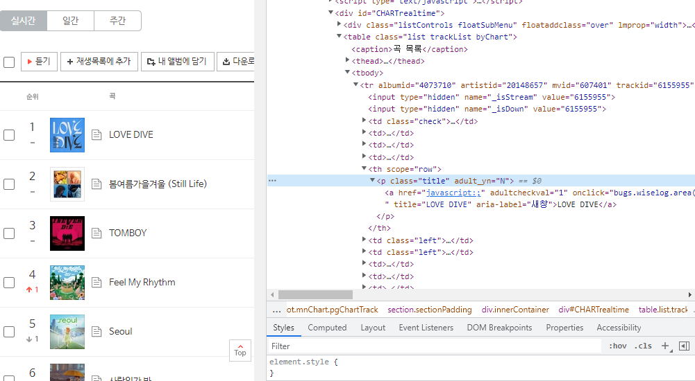

- 가상환경을 잡고 라이브러리를 설치한다.

```python
virtual venv 
source venv/Scripts/activate
pip install numpy pandas matplotlib seaborn
pip install requests
```

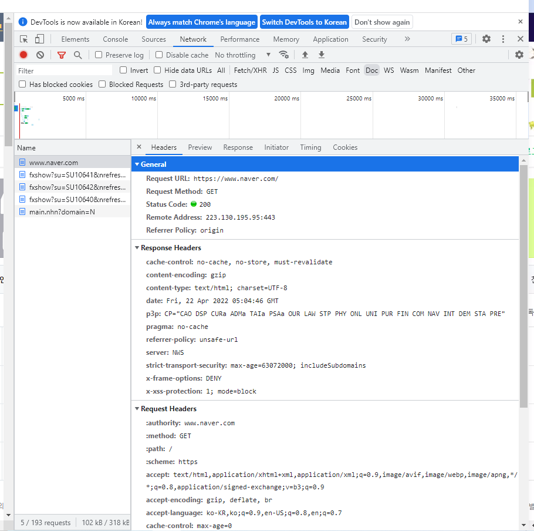

- index.html 파일

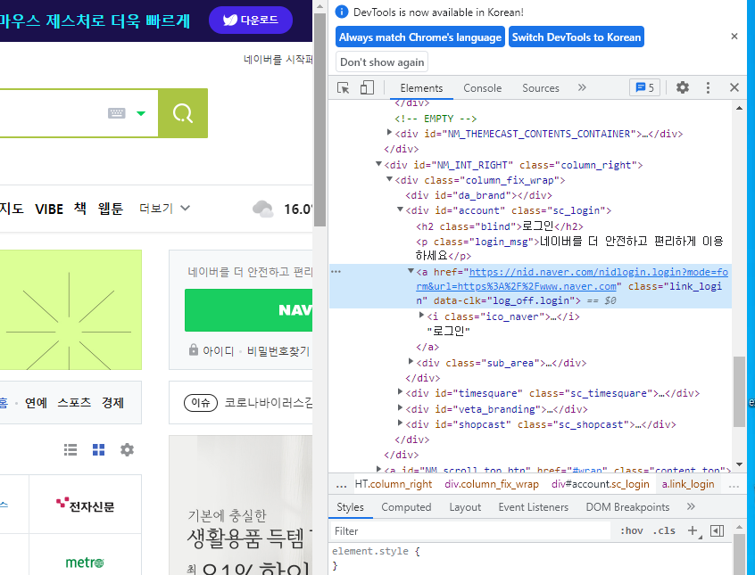

- [main.py](http://main.py) 파일
    
    ```python
    from bs4 import BeautifulSoup
    
    soup = BeautifulSoup(open("index.html", encoding='UTF-8'), "html.parser")
    print(type(soup))
    ```

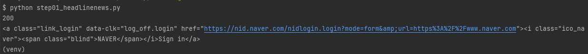

- index.html 파일에 한글이 있어 open() 안에 encoding을 넣어주었다.

```python
print(soup.find("p"))
```

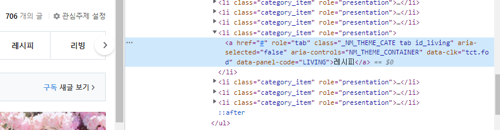

- 결과

```python
print(soup.find("div", class_ = "chapter02"))
```

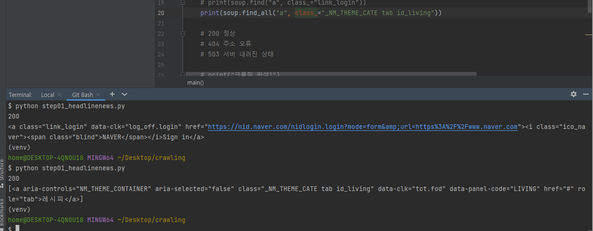

- 결과

```python
results = soup.find_all("p")
print(results[1])
```

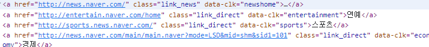

- 네이버 접속

```python
# 네이버 접속
import requests
from bs4 import BeautifulSoup

def main(url):
    req = requests.get(url)
    print(req.status_code)
    print(req.text)

if __name__ == "__main__":
    url = "https://www.naver.com/"
    main(url=url)
```

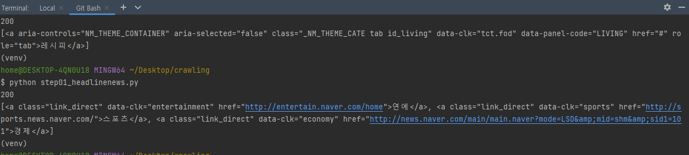

# Beautiful Soup Documentation

[Beautiful Soup Documentation - Beautiful Soup 4.9.0 documentation](https://www.crummy.com/software/BeautifulSoup/bs4/doc/#quick-start)

[Beautiful Soup](http://www.crummy.com/software/BeautifulSoup/) is a Python library for pulling data out of HTML and XML files. It works with your favorite parser to provide idiomatic ways of navigating, searching, and modifying the parse tree. It commonly saves programmers hours or days of work.

These instructions illustrate all major features of Beautiful Soup 4, with examples. I show you what the library is good for, how it works, how to use it, how to make it do what you want, and what to do when it violates your expectations.

This document covers Beautiful Soup version 4.11.0. The examples in this documentation were written for Python 3.8.

You might be looking for the documentation for [Beautiful Soup 3](http://www.crummy.com/software/BeautifulSoup/bs3/documentation.html). If so, you should know that Beautiful Soup 3 is no longer being developed and that all support for it was dropped on December 31, 2020. If you want to learn about the differences between Beautiful Soup 3 and Beautiful Soup 4, see [Porting code to BS4](https://www.crummy.com/software/BeautifulSoup/bs4/doc/#porting-code-to-bs4).

This documentation has been translated into other languages by Beautiful Soup users:

[Requests: HTTP for Humans™ - Requests 2.27.1 documentation](https://docs.python-requests.org/en/latest/)

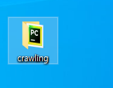

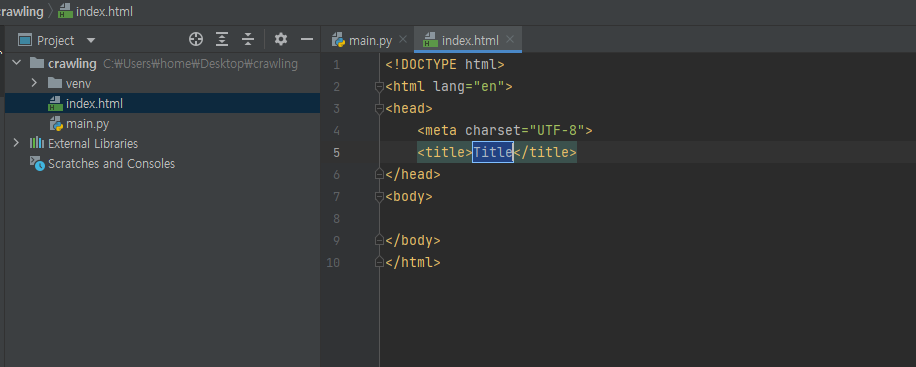

```python
import requests
from bs4 import BeautifulSoup

def main():
    CUSTOM_HEADER = {
        'referer' :  'https://www.naver.com/',
        'user-agent' : 'Mozilla/5.0 (Windows NT 10.0; Win64; x64) AppleWebKit/537.36 (KHTML, like Gecko) Chrome/100.0.4896.127 Safari/537.36',

    }

    # url = 'https://www.naver.com/1325324'

    url = 'https://www.naver.com/'
    req = requests.get(url = url, headers=CUSTOM_HEADER)
    print(req.status_code)
    # print(req.text)
    soup = BeautifulSoup(req.text, 'html.parser')
    #print(type(soup))
    print(soup.find("a", class_="link_login"))

    # 200 정상
    # 404 주소 오류
    # 503 서버 내려진 상태

    # print("크롤링 완성!")

if __name__ == "__main__":
    main()
```

- print(soup.find(”a”, class_=”link_loging”)) 로 밑의 결과값이 나온걸 확인.

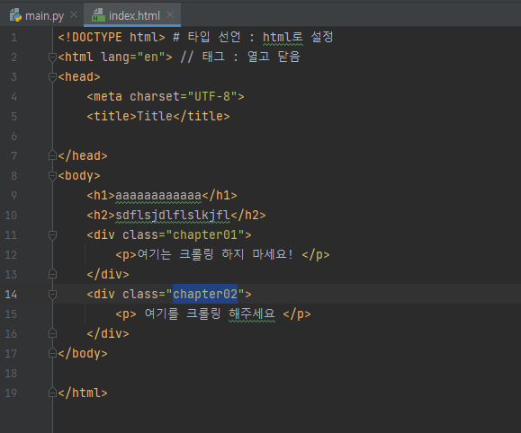

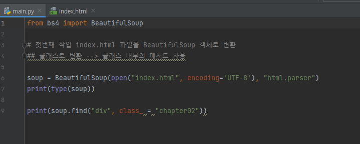

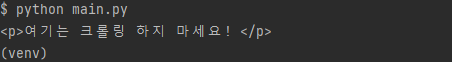

- find_all() 사용.

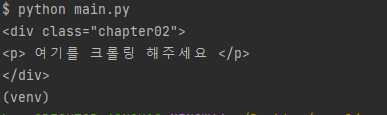

- <a>, class_=”link_news”에 해당하는것은 다 찾아 준다.

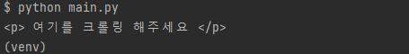

# 벅스에서 크롤링 연습.

- 벅스에서 노래의 제목을 뽑으려고 한다.

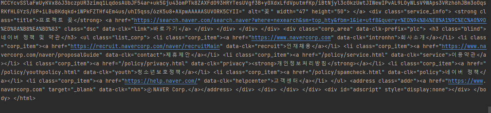

- 라이브러리 불러오기

```python
import requests
from bs4 import BeautifulSoup
import pandas as pd
```

- 메인 함수를 만들어 reqest 를 확인해준다.

```python
def main():
    CUSTOM_HEADER = {
        'User-Agent' : 'Mozilla/5.0 (Windows NT 10.0; Win64; x64) AppleWebKit/537.36 (KHTML, like Gecko) Chrome/100.0.4896.127 Safari/537.36'
    }
    url = 'https://music.bugs.co.kr/chart'
    req = requests.get(url = url, headers = CUSTOM_HEADER)
    print(req.status_code)

if __name__ == "__main__":
    main()
```

(venv)
home@DESKTOP-4QN0U18 MINGW64 ~/Desktop/crawling
$ python [pratice.py](http://pratice.py/)
200

- 200 : 정상, 404 : 주소 오류, 503 : 서버 종료

- soup에 request.text를 html.parser를 사용해서 추출.
- title에 soup에서 “p”클래스 “title” 해당하는것을 추출.

```python
soup = BeautifulSoup(req.text, 'html.parser')
title = soup.find_all("p", class_="title")
print(title)
```

(venv)
home@DESKTOP-4QN0U18 MINGW64 ~/Desktop/crawling
$ python [pratice.py](http://pratice.py/)
[<p adult_yn="N" class="title">
<a adultcheckval="1" aria-label="새창" href="javascript:;" onclick="bugs.wiselog.area('list_tr_09_chart');bugs.music.listen('6155955',true);
" title="LOVE DIVE">LOVE DIVE</a>
</p>, <p adult_yn="N" class="title">
<a adultcheckval="1" aria-label="새창" href="javascript:;" onclick="bugs.wiselog.area('list_tr_09_chart');bugs.music.listen('6155716',true);
" title="봄여름가을겨울 (Still Life)">봄여름가을겨울 (Still Life)</a>
</p>, <p adult_yn="N" class="title">
<a adultcheckval="1" aria-label="새창" href="javascript:;" onclick="bugs.wiselog.area('list_tr_09_chart');bugs.music.listen('6150789',true);
" title="TOMBOY">TOMBOY</a>
</p>, <p adult_yn="N" class="title">
<a adultcheckval="1" aria-label="새창" href="javascript:;" onclick="bugs.wiselog.area('list_tr_09_chart');bugs.music.listen('32494898',true);
" title="Feel My Rhythm">Feel My Rhythm</a>
</p>, <p adult_yn="N" class="title">
<a adultcheckval="1" aria-label="새창" href="javascript:;" onclick="bugs.wiselog.area('list_tr_09_chart');bugs.music.listen('6157637',true);
" title="Seoul">Seoul</a>
</p>, <p adult_yn="N" class="title">

...

- 타이틀 추출

```python
result = []
for a in title:
   print(a.get_text())
   result.append(a.get_text().strip('/'))
# .strip('/') 으로 '/' 를 제거한다.

df = pd.DataFrame({"music_title": result})
```

(venv)
home@DESKTOP-4QN0U18 MINGW64 ~/Desktop/crawling
$ python [pratice.py](http://pratice.py/)
music_title
0              LOVE DIVE
1   봄여름가을겨울 (Still Life)
2                 TOMBOY
3                  Seoul
4         Feel My Rhythm
..                   ...
95   너머 (The Other Side)
96        어른아이 (Toddler)
97             아무렇지 않은 척
98                    문득
99                   멜로디

[100 rows x 1 columns]

- csv파일로 만들기

```python
# 전체 코드
import requests
from bs4 import BeautifulSoup
import pandas as pd

# 벅스 크롤링 연습

def main():
    CUSTOM_HEADER = {
        'User-Agent' : 'Mozilla/5.0 (Windows NT 10.0; Win64; x64) AppleWebKit/537.36 (KHTML, like Gecko) Chrome/100.0.4896.127 Safari/537.36'
    }
    url = 'https://music.bugs.co.kr/chart'
    req = requests.get(url = url, headers = CUSTOM_HEADER)
    # print(req.status_code)
    soup = BeautifulSoup(req.text, 'html.parser')
    title = soup.find_all("p", class_="title")
    # print(soup)
    # print(title)

    result = []
    for a in title:
        # print(a.get_text().strip('/n'))
        result.append(a.get_text().strip('/n'))

    df = pd.DataFrame({"music_title": result})

    # print(df)
    print(df.to_csv("music_bugs.csv"))

if __name__ == "__main__":
    main()
```

- 결과

```
,music_title
0,LOVE DIVE
1,봄여름가을겨울 (Still Life)
2,TOMBOY
3,Seoul
4,Feel My Rhythm
5,사랑인가 봐
6,Love story
7,That's Hilarious
8,우리들의 블루스
9,GANADARA (Feat. 아이유)
10,LOVE me
...
```